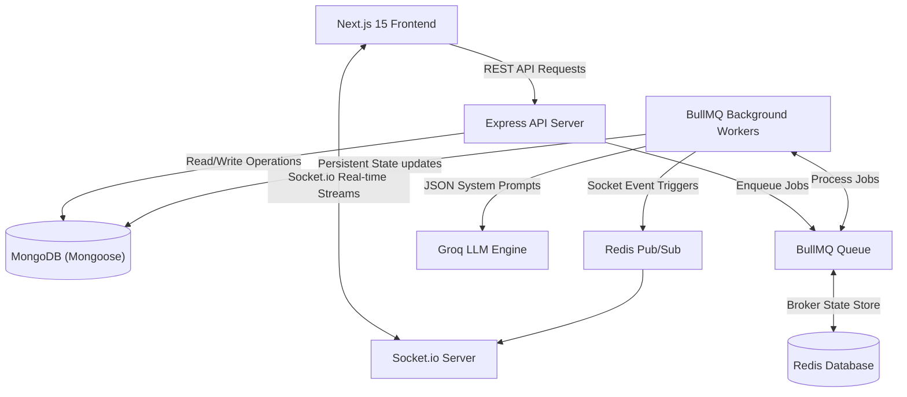
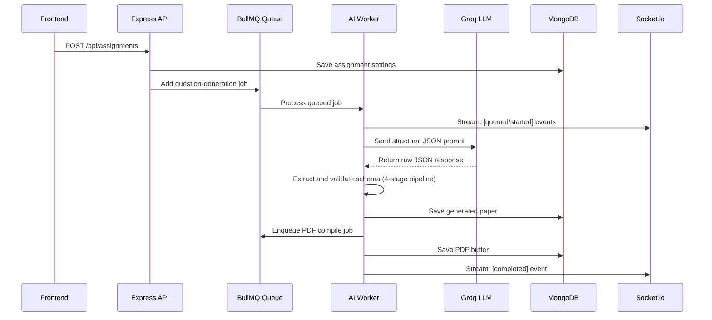

# VedaAI 🛡️

**VedaAI** is an enterprise-grade, high-performance AI Assessment Creator platform built for modern educators. It enables teachers to configure assessments, generate syllabus-aligned question papers utilizing advanced LLMs, stream real-time progression over WebSockets, manage student groups, and export beautifully formatted, print-ready PDFs.

<p align="center">
  <strong>Decoupled, Resilient, Event-Driven Architecture for Digital Education</strong>
</p>

<p align="center">
  
  
  
  
  
</p>

---

## ✨ Features Spotlight

| Feature | Tech | Benefit |
| :--- | :--- | :--- |
| **AI Assessment Generator** | Groq (`llama-3.3-70b-versatile`) | Builds verified, syllabus-aligned test papers in seconds. |
| **Decoupled Architecture** | BullMQ + Redis + Workers | Guaranteed backend uptime; no request timeouts during heavy LLM generation. |
| **Real-time Live Stream** | Socket.io + Redis Pub/Sub | Streams step-by-step progress from queueing to generation directly to the client. |
| **Multi-format PDF Generation**| pdf-lib (Server & Client side) | Generates pristine, print-ready PDFs with automatic pagination and margins. |
| **Clean Multi-tenant Workspace** | Zustand + Mongoose | Beautiful HSL colors, responsive sidebar layout, and absolute state persistence. |

---

## 🏗️ System Architecture & Data Flow

VedaAI is architected as a highly scalable, decoupled, multi-tier system. It separates lightweight API serving from computationally heavy AI parser background workers, guaranteeing rapid request processing and uninterrupted service even under peak assessment generation demands.

### Technical Architecture Diagram



### End-to-End Data Pipeline



---

## 🚀 Architectural & Design Decisions

### 1. Teacher-First UX Design
Every interaction is designed to minimize friction. Teachers configure an entire syllabus-aligned assignment in under 60 seconds and receive a complete, exam-ready paper with robust editing tools.

### 2. BullMQ-Powered Reliability
AI generation is offloaded to BullMQ workers, preventing API server blocks and enabling intelligent retry policies (exponential backoff) on transient LLM/network failures.

### 3. Rigorous Schema Validation Pipeline
Raw LLM output passes through a 4-stage pipeline before reaching your database, ensuring absolute structure integrity:
```text
Raw Output → JSON Extraction → Schema Validation → Question/Marks Verification → Database
```

---

## 🛠️ Tech Stack

**Frontend:**
- Next.js 15 App Router, React 19, TypeScript
- TailwindCSS, Framer Motion, lucide-react
- Zustand, React Hook Form, Zod
- Axios, Socket.io Client, react-hot-toast
- pdf-lib for client-side export

**Backend:**
- Node.js, Express, TypeScript
- MongoDB + Mongoose
- Redis + BullMQ
- Socket.io
- Groq SDK with `llama-3.3-70b-versatile`
- pdf-lib for backend PDF generation
- JWT auth with demo teacher credentials

---

## 📂 Project Structure

```text
VedaAI/
├── backend/
│   ├── src/
│   │   ├── config/          # Database, Redis, and environment configs
│   │   ├── controllers/     # Route request handlers
│   │   ├── middlewares/      # Auth security middleware, error handlers
│   │   ├── models/           # Mongoose schemas (User, Assignment, Paper, Log)
│   │   ├── queues/           # BullMQ queue & job definitions
│   │   ├── routes/           # Express API endpoints
│   │   ├── services/         # Core business logic & LLM generation pipes
│   │   ├── sockets/          # Socket.io connection systems
│   │   └── workers/          # BullMQ worker processes
│   └── .env.example
├── frontend/
│   ├── app/                  # Next.js App Router (Layouts & Pages)
│   ├── components/           # Reusable UI component libraries
│   ├── features/             # Business feature modules (Auth, Assignments)
│   ├── services/             # Axios and Socket connections
│   ├── store/                # Zustand State Stores
│   ├── types/                # Typescript Definitions
│   └── utils/                # Formatting and styling utils
└── docker-compose.yml
```

---

## 🔑 Demo Access

The platform includes demo credentials to quickly review features:

```text
Email: teacher@vedai.demo
Password: VedaAI@123
```
* With `NEXT_PUBLIC_DEMO_MODE=true`, these credentials unlock offline Zustand state simulation.
* With `NEXT_PUBLIC_DEMO_MODE=false`, the signup and login features authenticate against the live MongoDB cluster.

---

## ⚙️ Local Development Setup

### 1. Backend Server & Workers
```bash
cd backend
cp .env.example .env
# Edit backend/.env and append your GROQ_API_KEY
npm install
npm run dev

# (In a separate terminal tab) Run the background BullMQ Worker
npm run dev:worker
```

### 2. Frontend Application
```bash
cd frontend
cp .env.example .env.local
# Set NEXT_PUBLIC_DEMO_MODE=false to enable database persistence
npm install
npm run dev
```

---

## 🐳 Docker Orchestration

You can spin up the entire cluster (MongoDB, Redis, API Server, Worker, Frontend) with a single command:
```bash
docker compose up --build
```
**Addresses**:
* **Frontend**: `http://localhost:3000`
* **Backend API**: `http://localhost:4000`
* **MongoDB**: `mongodb://localhost:27017/vedai`
* **Redis**: `redis://localhost:6379`

---

## 📡 API Mappings

| Method | Endpoint | Description |
| :--- | :--- | :--- |
| `POST` | `/api/auth/register` | Register a new teacher account |
| `POST` | `/api/auth/login` | Authenticate and receive JWT cookie |
| `GET` | `/api/auth/me` | Fetch active teacher profile |
| `POST` | `/api/assignments` | Create assessment and trigger AI generation |
| `GET` | `/api/assignments` | List all assignments for active teacher |
| `GET` | `/api/assignments/:id` | Fetch detailed assignment paper |
| `POST` | `/api/assignments/:id/regenerate` | Re-queue paper generation |
| `GET` | `/api/assignments/:id/pdf` | Download formatted PDF paper |
| `GET` | `/api/health` | Service Health check (DB + Cache status) |

---

## Environment Variables

**Backend:**
```bash
PORT=4000
FRONTEND_URL=http://localhost:3000
MONGODB_URI=mongodb://localhost:27017/vedai
REDIS_URL=redis://localhost:6379
JWT_SECRET=replace-with-a-long-random-secret
GROQ_API_KEY=
GROQ_MODEL=llama-3.3-70b-versatile
```

**Frontend:**
```bash
NEXT_PUBLIC_API_URL=http://localhost:4000/api
NEXT_PUBLIC_SOCKET_URL=http://localhost:4000
NEXT_PUBLIC_DEMO_MODE=true
```

---

## Production Deployment Guide

VedaAI is deployed as an decoupled, multi-tier system. For a production deployment, prepare a **Frontend Web App**, a **Backend API Server**, and a **Background Worker Instance**, along with managed database servers.

### 1. Databases
* **MongoDB**: Deploy a managed cluster using [MongoDB Atlas](https://www.mongodb.com/products/platform/atlas-database).
* **Redis**: Provision high-performance Pub/Sub caching using [Redis Cloud](https://redis.io/cloud/) or [Upstash](https://upstash.com).

### 2. API Server & BullMQ Worker (Railway / Render)
Deploy two separate services from your `/backend` directory:
1. **API Service**: Root: `backend`, Start: `npm run start`
2. **Worker Service**: Root: `backend`, Start: `npm run start:worker` (Keep internal/no public domains)

**Required Env variables**:
```env
NODE_ENV=production
PORT=4000
FRONTEND_URL=https://your-veda-frontend.vercel.app
MONGODB_URI=mongodb+srv://...
REDIS_URL=rediss://...
JWT_SECRET=your-production-jwt-secret-key-32-chars
JWT_EXPIRES_IN=7d
GROQ_API_KEY=gsk_...
GROQ_MODEL=llama-3.3-70b-versatile
```

### 3. Frontend App (Vercel)
Point your Vercel project to the `/frontend` root and add the backend variables:
```env
NEXT_PUBLIC_API_URL=https://your-backend-api.railway.app/api
NEXT_PUBLIC_SOCKET_URL=https://your-backend-api.railway.app
NEXT_PUBLIC_DEMO_MODE=false
```

---

## 🔒 Security Hardening Status

- [x] **Strict Content-Security-Policies**: Integrated via `Helmet` middleware.
- [x] **CORS Origin Filtering**: Secured backend endpoints to trust only verified hosts.
- [x] **Zod Validation Layers**: Sanitizes all payload parameters on entry.
- [x] **Database Password Hashing**: Secured via robust Bcrypt (12-salt factors).
- [x] **HTTP-only Cookie Authorization**: Protects auth sessions from XSS risks.
